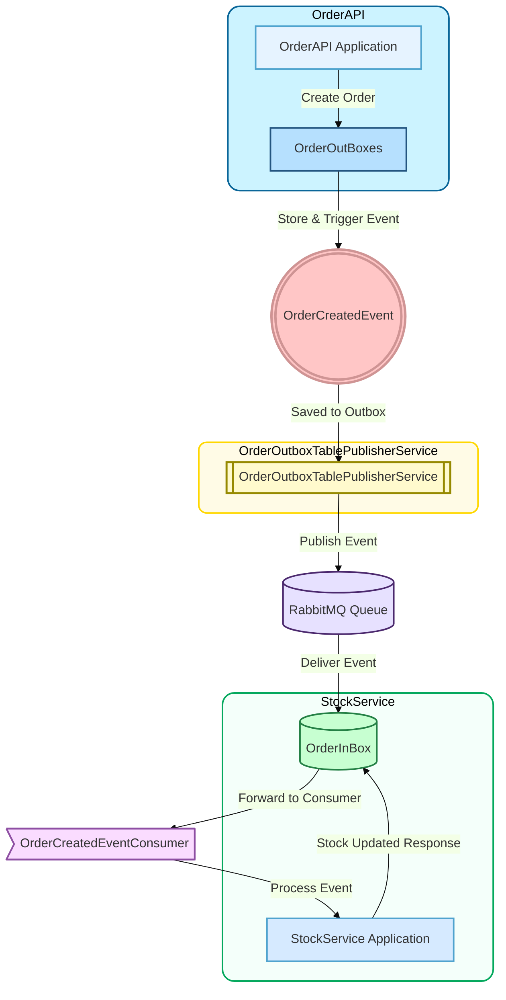

-----

# 🚀 Microservices - Outbox & InBox Design Pattern

This repository demonstrates a microservices architecture that implements the **Outbox and InBox design patterns** to ensure transactional consistency in a distributed system. It uses **MassTransit** and **RabbitMQ** for reliable, asynchronous communication.

## 🎯 Project Goal

The primary goal is to **guarantee data consistency** and **reliable message delivery** between services, even in the event of system failures or network issues.

## 🏗️ Architecture

The system consists of several decoupled microservices that communicate asynchronously. The core of the architecture relies on the Outbox and InBox patterns to handle distributed transactions without compromising data integrity.

## 📊 Diagram

### Flow Description

1.  **Transactional Write:** When a new order is created in the `OrderAPI` (Service A), the business logic and the corresponding `OrderCreatedEvent` are stored transactionally in the **Outbox Table**. This guarantees that the order and the event are saved in a single, atomic operation.
2.  **Reliable Publishing:** A separate **`OrderOutboxTablePublisherService`** polls the Outbox Table at regular intervals for unprocessed events. It then reliably publishes these events to a **RabbitMQ Queue**.
3.  **Idempotent Consumption:** The `StockService`'s consumer receives the event. To prevent duplicate processing, it first checks its **InBox Table** to see if the message has been processed before.
4.  **Finalization:** If the message is new, the consumer processes the event (e.g., updates stock) and records the message's unique identifier in the **InBox Table**, ensuring the distributed transaction is completed safely and consistently.

## 📸 Database Operations

### 1\. Events Awaiting Publication

In the Outbox table, the ProcessedDate column for some IdempotentTokens was intentionally set to NULL. The OrderOutboxPublisherService, 
with its 5-second polling interval, immediately detected these NULL records, queued them for publication, and processed them. As a result, the ProcessedDate values for these records were updated,
and the NULL status was resolved. This process ensures reliable message publishing and maintains system consistency, even if there is a temporary disconnection between services.

### 2\. Events Successfully Published

In the Outbox table, the ProcessedDate column for some IdempotentTokens was set back to NULL, triggering the re-processing of the messages. Thanks to the OrderOutboxTablePublisherService's 5-second periodic check,
these unprocessed (NULL) records were instantly detected, queued for RabbitMQ, and successfully processed. As a result of this operation,
the ProcessedDate columns for the relevant records were updated, confirming that the messages were completed without duplicate processing. 
This mechanism ensures that messages are not lost and that the system's data integrity is maintained, even during service connection interruptions.

-----

## 📂 Project Structure

### **`OrderAPI`**

  * **Purpose:** The service responsible for creating and managing orders.
  * **Database:** MSSQL is used to store order data and the Outbox table.

### **`OrderOutboxTablePublisherService`**

  * **Purpose:** A dedicated service for the Outbox pattern. It polls the Outbox table and publishes events to RabbitMQ.
  * **Key Components:**
      * `OrderOutboxPublishJob.cs`: A Quartz.NET job that handles the periodic polling.
      * `OrderOutboxSingletonDatabase.cs`: Manages database connections for the Outbox table.

### **`StockService`**

  * **Purpose:** Manages the product inventory. It also implements the Inbox pattern.
  * **Database:** MongoDB is used for stock data.
  * **Key Components:**
      * `OrderCreatedEventConsumer.cs`: Consumes events and applies the Inbox pattern to prevent duplicates.

### **`Shared`**

  * **Purpose:** A common library for shared message contracts and settings.

-----

## ⚙️ Setup & Run

1.  Start **RabbitMQ**, **MSSQL**, and **MongoDB**.
2.  Update connection strings in `appsettings.json` files for each service.
3.  Run database migrations for the `OrderAPI` and `OrderOutboxTablePublisherService`.
4.  Launch each service: `OrderAPI`, `OrderOutboxTablePublisherService`, and `StockService`.
5.  Use `OrderAPI` endpoints to create orders and observe the full message flow.
